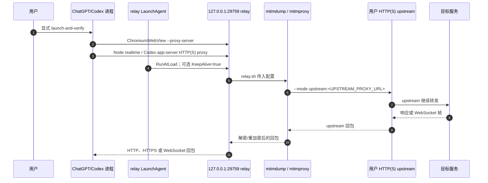

# 架构说明

English summary: The relay is a process-scoped loopback mitmproxy hop. It listens on `127.0.0.1:29759` by default and forwards to the HTTP(S) upstream URL supplied at installation time. Only the relay LaunchAgent may use `KeepAlive`; ChatGPT/Codex is never installed as a KeepAlive service, and the launcher has no ordinary direct-launch fallback.

## 组件与职责

| 组件 | 实际职责 | 明确不做的事 |
| --- | --- | --- |
| `Codex Proxy.app` / `bin/launch-codex-proxied.sh` | 用户显式启动 ChatGPT.app；为 Chromium/WebView 指定 loopback relay `--proxy-server`；为 Node realtime/Codex 注入 HTTP(S) proxy、CA 与 `NODE_USE_ENV_PROXY=1`；校验进程环境与 socket。 | 不修改官方应用包；不安装 ChatGPT KeepAlive；不关闭 TLS 校验；失败时不主动另行启动普通直连。 |
| `bin/relay.sh` | 从配置读取 loopback 地址、端口、CA 目录和 upstream，执行 `mitmdump --mode upstream:<URL>`。 | 不选择或生成用户的 upstream 凭据；不把流量改成系统代理。 |
| mitmproxy / mitmdump | 在本地端口执行 HTTP(S)/WebSocket 中继和 TLS interception。 | 不代表目标服务或 upstream 的可用性。 |
| relay LaunchAgent | 安装时生成 plist；可 `RunAtLoad`，并带 `KeepAlive=true`。 | 不托管 ChatGPT/Codex。安装默认 `--no-start`，不会替用户 bootstrap job。 |
| `bin/proxy-health.sh` | 检查 upstream、relay、HTTPS、Codex doctor 和 WebSocket 探针。 | 不是 Remote/图片业务验收。 |
| `bin/openai-network-audit.sh` | 用显式 proxy/CA 或配置运行 HTTP(S) 审计，可选调用 `codex doctor`。 | 不修改系统网络配置。 |

## 数据流



`UPSTREAM_PROXY_URL` 必须是 `http://` 或 `https://` authority，且不能有 userinfo、路径、查询或片段。relay 监听地址必须是 loopback，默认 `127.0.0.1:29759`；`LISTEN_PORT` 可以调整，但所有进程和探针必须使用同一配置。

## 进程级环境边界

launcher 为本次 ChatGPT/Codex 启动设置：

```text
HTTP_PROXY=<loopback relay URL>
HTTPS_PROXY=<loopback relay URL>
http_proxy=<loopback relay URL>
https_proxy=<loopback relay URL>
CODEX_CA_CERTIFICATE=<runtime>/mitmproxy/mitmproxy-ca-cert.pem
SSL_CERT_FILE=<同一 CA>
NODE_EXTRA_CA_CERTS=<同一 CA>
NODE_USE_ENV_PROXY=1
NO_PROXY=localhost,127.0.0.1,::1
no_proxy=localhost,127.0.0.1,::1
```

`ALL_PROXY` 及大小写变体、SOCKS/WS/FTP 与常见 Git/npm 代理覆盖变量会在启动器中移除，避免隐藏的额外代理路径。环境只随该次启动的进程继承，不会成为系统级代理设置。

## LaunchAgent 与失败路径

- `scripts/install.sh` 默认 `--no-start`，只安装 runtime、应用和 plist，不改变 launchd 中已有 job。
- 使用 `--start`，或随后执行 `bin/start-relay.sh --config <绝对路径>`，才会改变 relay job。`start-relay.sh` 对未加载的精确 plist 执行 bootstrap；对已加载且 listener/PID/launchd path 身份匹配的 job 执行受控 kickstart，从而应用当前配置。因为 kickstart 会重启 relay，ChatGPT/Codex 仍运行时该动作会被拒绝。未知 listener 一律拒绝，不会被杀掉。
- plist 的 `KeepAlive=true` 只维持 `relay.sh`；ChatGPT/Codex 没有 KeepAlive、自动循环重启或“看门狗”。
- `launch-codex-proxied.sh` 在启动前后检查 upstream、relay listener、进程身份、主进程 `--proxy-server`、Chromium NetworkService→relay、Node realtime 环境和 Codex app-server→relay；失败时会报告错误并拒绝 direct-launch fallback。
- 若 postflight 在应用已经启动后失败，脚本不会未经确认自动 TERM；失败实例可能仍运行且状态未验证，用户必须手动退出后再诊断。
- `launch-codex-proxied.sh` 的 direct-launch fallback 仅指它不会在校验失败后主动再做一次普通启动；GUI/Chromium 等子进程是否遵守环境变量，仍需按业务验证。
- relay/upstream 不可用时保留 launcher 失败路径；不能仅凭主进程和 app-server 检查推断所有 GUI/Chromium 流量都经过 relay。

## TLS 与明文能力

mitmproxy 在 runtime 的 `mitmproxy/` 目录维护本地 CA。经过 interception 的 HTTPS 流量会在 relay 进程中以解密明文存在，然后重新建立到 upstream/目标的连接；因此 relay、CA 文件及其权限属于安全边界。项目不把 CA 注入系统钥匙串或系统信任库，官方 ChatGPT.app 也不被改包。

日志文件位于 runtime 的 `relay.log` 和 `launcher.log`。默认 relay 参数降低终端流量细节，但不能把 MITM 当作端到端加密或绝对的无明文系统；请按 [SECURITY.md](../SECURITY.md) 处理日志和凭据。

## `PASSTHROUGH_REGEX` 的精确语义

配置解析器只校验该值是有效的扩展正则；`bin/relay.sh` 在值非空时原样追加：

```text
--ignore-hosts <PASSTHROUGH_REGEX>
```

这采用 mitmproxy `ignore-hosts` 的主机匹配语义：匹配的主机跳过 TLS interception。它不是系统代理白名单，也不会触发 launcher 的 ChatGPT 直连回退；匹配后的具体转发方式由当前 mitmproxy mode 决定，本项目默认传入 upstream mode。空值则完全不传 `--ignore-hosts`。默认安装值用于 `localhost`、`127.0.0.1` 和 `::1`，而不是任意域名。

## Remote、图片与 Responses WebSocket

Remote 连接、图片上传/下载和其他业务链路必须在真实账号、工作区和网络中逐项验证。本仓库只验证本地 relay、HTTP(S) 探针和部分 WebSocket 可达性，不承诺 Remote 或图片功能。

launcher 的可验证对象主要是 ChatGPT 主进程和 Codex app-server 的环境，以及多轮采样到的已建立 TCP socket；它不检查 UDP/QUIC，也不枚举所有 GUI/Chromium helper。部分 GUI 或 Chromium 栈可能不继承或不遵守这些环境变量，因此图片、Remote 和其他业务流量必须做真实操作验证。

`5/5` 的记录只表示某一类 Responses WebSocket 重试现象；它不是全局成功率、Remote SLA 或图片修复保证。请参考 [官方 Remote 连接要求](https://learn.chatgpt.com/docs/remote-connections)，并把真实业务结果与 [docs/TROUBLESHOOTING.md](TROUBLESHOOTING.md) 中的 transport 诊断分开记录。

## 兼容性边界

目标是 macOS；当前验证环境为 macOS 26 arm64。Intel 和其他 macOS 版本目前没有项目级保证。迁移到不同架构或版本时，应重新执行安装器 dry-run、relay health、应用进程/socket 验证以及真实业务测试。

## 相关入口

- 安装：[`scripts/install.sh`](../scripts/install.sh)
- 启动 relay：[`bin/start-relay.sh`](../bin/start-relay.sh)
- 进程启动/状态：[`bin/launch-codex-proxied.sh`](../bin/launch-codex-proxied.sh)
- 健康检查：[`bin/proxy-health.sh`](../bin/proxy-health.sh)
- 网络审计：[`bin/openai-network-audit.sh`](../bin/openai-network-audit.sh)
- 卸载和 runtime 保留策略：[`scripts/uninstall.sh`](../scripts/uninstall.sh)、[RUNTIME.md](RUNTIME.md)
